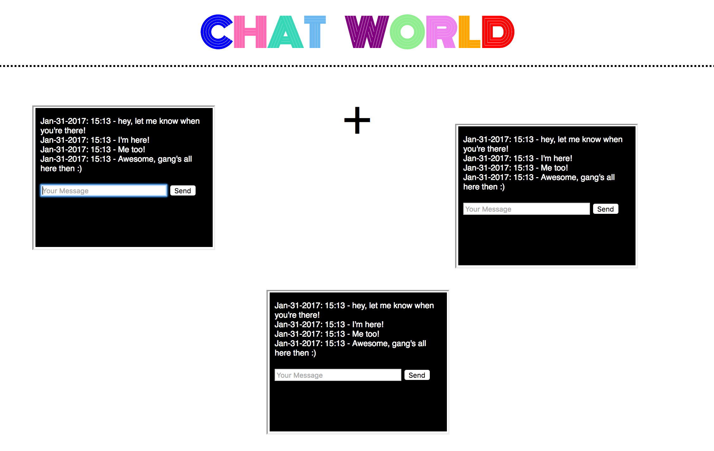

## Chat-World 

#### A simple client-side application that allows cross-communication between iFrames 

Each time the "+" is clicked, a draggable iframe element is created on the page, with an src that directs to 'other.html'.  The iframe html consists of a simple text input/submit form that, when completed and hit 'send' (or enter), a message is sent to the parent, and once received, is then sent back down to all of the iframe nodes, making it visible in each individual frame.  

Tech used:
* HTML5
* CSS
* Javascript (some JQuery)
